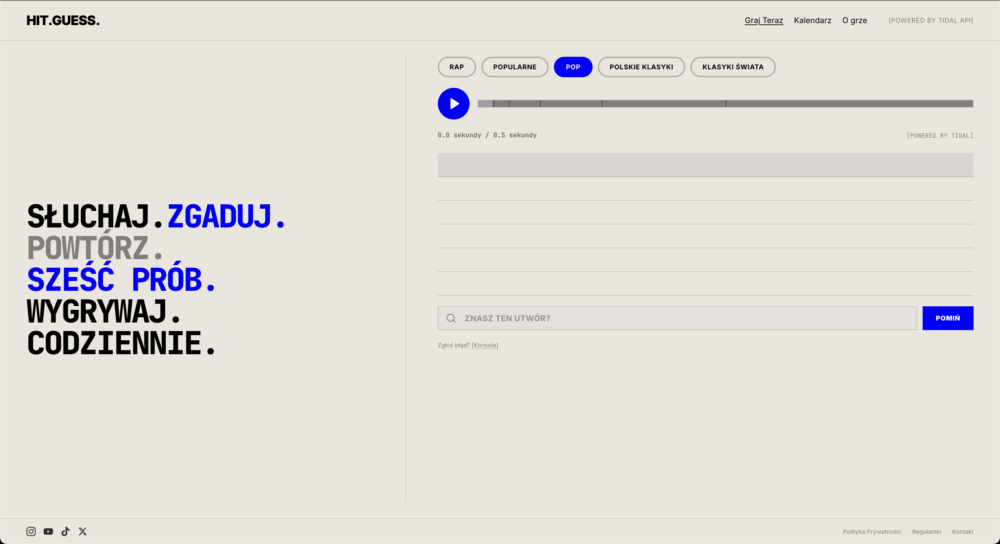
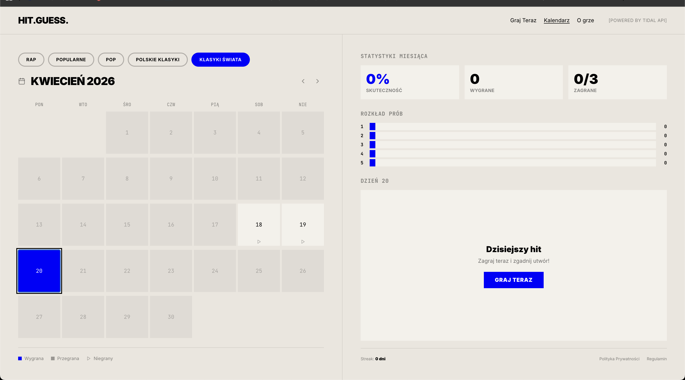
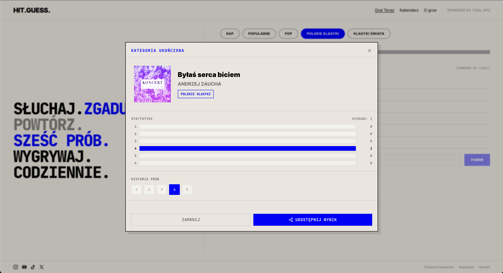
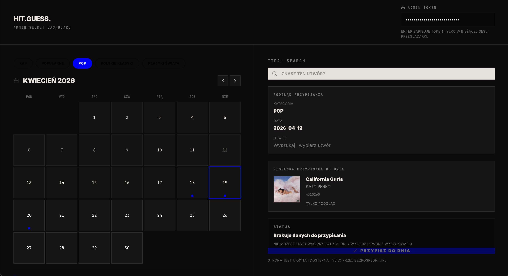

# HIT.GUESS. 🎵

**A daily music guessing game powered by the TIDAL API – the musical equivalent of the popular Wordle.**



## ⚙️ Architecture & Tech Stack

The project is an advanced Full-Stack web application. Below is its technological foundation:

* **Frontend:** Next.js 16+ (App Router), React, TypeScript, Tailwind CSS, shadcn/ui.
* **Backend:** Python 3.13+, FastAPI (Async).
* **Database & Cache:** PostgreSQL (managed by SQLAlchemy and Alembic migrations) and Redis (used for caching TIDAL results, rate-limiting, and session management).
* **External API:** TIDAL API (OAuth 2.0).
* **Infrastructure:** A `docker-compose` setup for local development. Production deployment is designed for Railway using `Dockerfile` and native Postgres/Redis plugins.

## 🛡️ Security Golden Rules (Anti-Cheat & Zero-Leak)

* **Zero-Leak Policy:** Protection against cheaters is our top priority. Simply inspecting the "Network tab" in the developer console will not allow anyone to cheat. The frontend **never** receives track metadata (such as title, artist, cover art, or direct TIDAL ID) until the player wins or exhausts all guesses. Initializing the game only fetches a generated UUID (`game_id`) and a hidden HLS stream (`preview_url`).
* **TIDAL Proxy:** The frontend is strictly forbidden from communicating directly with TIDAL services. All traffic, from downloading manifests to search queries, goes through a secured endpoint (`/api/v1/...`) on our FastAPI server. This prevents API key leaks, optimizes traffic with Redis caching, and protects query limits via rate-limiting.



## 🎵 Game Mechanics & Player Precision

* **6 Guesses:** The gameplay consists of a maximum of six attempts (guesses or skips).
* **Time Intervals:** The audio fragment played progressively lengthens with each attempt: `[0.5s, 1s, 2s, 4s, 8s, 20s]`.
* **Seamless Skip:** An incredibly smooth mechanism allowing the player to extend the listened fragment "on the fly" after hitting the "Skip" button, without interrupting or annoyingly pausing the playing audio.
* **Millisecond Precision:** The audio player (`audio-player.tsx`) relies on the `hls.js` library. To ensure the sound cuts off perfectly according to the limits, a `requestAnimationFrame` loop was implemented (replacing the overly slow and inaccurate `ontimeupdate` event).
* **Local State Management:** An advanced `useGame` hook is responsible for the application state. The player's progress is saved in `localStorage` with a unique key for a given day and category (e.g., `hit_guess_daily_state_2026-04-20_POP`), allowing users to safely close and return to the app without losing progress.



## 🛠️ Dev Mode (Admin Tools)

The application features a hidden `Dev Mode` administrative panel to facilitate content management:
* A built-in, integrated live TIDAL search engine.
* Simple assignment of searched and selected songs as puzzles for a specific day and category in the calendar.



## 🚀 Deployment & Local Setup

The application is tailored for deployment on the **Railway** platform. A configuration is provided to run everything locally:

1.  Make sure you have Docker installed (`docker` and `docker-compose`).
2.  Copy the environment files (create `.env` based on `.env.example` in the respective folders and fill in the authentication keys for the TIDAL API and Postgres).
3.  From the root directory, run the technical stack:
    ```bash
    docker-compose up --build
    ```
4.  The frontend, FastAPI, and Redis will start in containers (FastAPI docs are accessible by default at `:8000/docs`).

---
**Project: HIT.GUESS.**